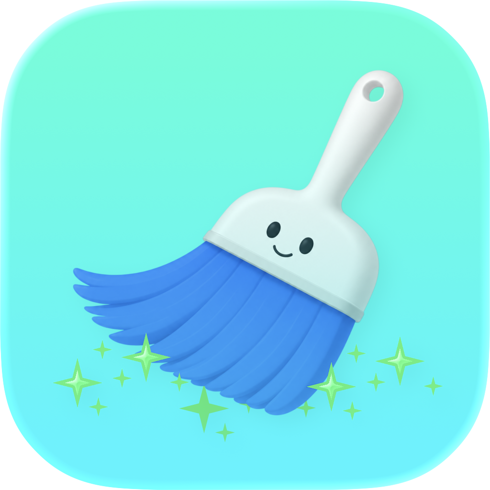

<p align="center">
  
</p>

# Scopino

> **Pulizia automatica e intelligente dei residui delle app disinstallate su macOS.**

Scopino è un'app macOS leggera che vive nella menu bar e monitora in background la cartella `/Applications`. Quando rileva la rimozione di un'app, trova automaticamente tutti i file residui lasciati sul disco e propone di eliminarli con un click.

---

## Indice

- [Screenshots](#screenshots)
- [Funzionalità](#funzionalità)
- [Requisiti](#requisiti)
- [Installazione](#installazione)
- [Architettura](#architettura)
- [Struttura del progetto](#struttura-del-progetto)
- [Componenti principali](#componenti-principali)
  - [Core](#core)
  - [Models](#models)
  - [Services](#services)
  - [Storage](#storage)
  - [UI](#ui)
  - [XPC Helper](#xpc-helper)
- [Permessi richiesti](#permessi-richiesti)
- [Distribuzione](#distribuzione)
- [Aggiornamenti automatici](#aggiornamenti-automatici-sparkle)
- [Contribuire](#contribuire)
- [Licenza](#licenza)

---

## Funzionalità

### Rilevamento automatico
- Monitora `/Applications` in tempo reale tramite **FSEvents**
- Rileva la rimozione di qualsiasi app entro 1-2 secondi
- Legge il `bundleID` dall'`Info.plist` prima che l'app venga rimossa
- Ignora automaticamente le app di sistema Apple (`com.apple.*`)

### Ricerca residui
- Scansiona **12+ path di sistema** dove le app lasciano file
- Database integrato (**KnownResiduals.json**) con path extra per 15+ app popolari (Spotify, Chrome, Firefox, VSCode, Docker, Zoom, Slack, ecc.)
- Calcolo dimensione ricorsivo per ogni residuo trovato
- Deduplicazione automatica dei risultati
- Categorizzazione per tipo: Preferenze, Cache, Log, Container, LaunchAgent, ecc.

### Pulizia sicura
- Sposta i file nel **Cestino** invece di eliminarli definitivamente → recuperabili
- Protezione assoluta: blocklist di path critici di sistema (`/System/`, `/usr/`, `~/Documents/`, ecc.)
- Supporto file privilegiati via **XPC Helper** (LaunchDaemons, PrivilegedHelperTools)
- Selezione granulare: deseleziona singoli file o intere categorie prima di pulire

### UI
- **Menu bar only** - nessuna icona nel Dock
- Finestra di proposta con lista residui, dimensioni e checkbox per selezione
- Progress view animata durante la pulizia
- Schermata di completamento con riepilogo (rimossi / falliti / ignorati)
- Cronologia completa di tutte le sessioni di pulizia
- Finestra Impostazioni con controllo di tutti i permessi

### Notifiche
- Notifica macOS nativa quando vengono trovati residui
- Notifica di completamento pulizia con riepilogo
- Azioni interattive direttamente dalla notifica ("Pulisci ora" / "Ignora")

### Aggiornamenti automatici
- Integrazione **Sparkle 2** per aggiornamenti automatici
- Verifica in background con notifica non invasiva
- Controllo manuale da menu o da Impostazioni
- Firme EdDSA per sicurezza degli aggiornamenti

---

## Requisiti

| Requisito | Versione |
|---|---|
| macOS | 26.2 o superiore |
| Xcode | 16.0 o superiore |
| Swift | 6.0 o superiore |
| Apple Developer Account | Richiesto per distribuzione |

---

## Installazione

### Da DMG (utenti)

1. Scarica `Scopino.dmg` dalla [pagina releases](https://github.com/alemicieli09/Scopino/releases)
2. Trascina `Scopino.app` nella cartella Applicazioni
3. Avvia Scopino
4. Concedi il permesso **Accesso completo al disco** in Impostazioni → Privacy e Sicurezza

### Da sorgente (sviluppatori)

```bash
# Clona il repository
git clone https://github.com/alemicieli09/Scopino.git
cd Scopino

# Apri in Xcode
open Scopino.xcodeproj
```

Seleziona il target **Scopino**, scegli il tuo team di sviluppo in Signing & Capabilities e premi `Cmd+R`.

---

## Architettura

```
┌─────────────────────────────────────────────────────┐
│                    Scopino.app                      │
│                                                     │
│  ┌─────────────┐    ┌──────────────────────────┐    │
│  │  AppWatcher │    │   AppRemovalDetector     │    │
│  │  (FSEvents) │───▶│   (filtra, costruisce    │    │
│  └─────────────┘    │    DetectedApp)          │    │
│                     └──────────┬───────────────┘    │
│                                │                    │
│                     ┌──────────▼───────────────┐    │
│                     │    ResidualFinder        │    │
│                     │  • path standard         │    │
│                     │  • KnownResidualsDB      │    │
│                     └──────────┬───────────────┘    │
│                                │                    │
│                     ┌──────────▼───────────────┐    │
│                     │   CleanupSession         │    │
│                     │   (ObservableObject)     │    │
│                     └──────────┬───────────────┘    │
│                                │                     │
│            ┌───────────────────┼──────────────┐     │
│            │                   │              │     │
│   ┌────────▼──────┐  ┌────────▼──────┐  ┌───▼────┐  │
│   │ResidualCleaner│  │CleanupProposal│  │Session│   │
│   │  (Trash /     │  │    Window     │  │ Store │   │
│   │  XPC Helper)  │  │    (SwiftUI)  │  │ (JSON)│   │
│   └───────────────┘  └───────────────┘  └────────┘  │
└─────────────────────────────────────────────────────┘
         │ XPC
┌────────▼────────────┐
│  ScopinoHelper      │
│  (root process)     │
│  rimuove file in    │
│  /Library/          │
└─────────────────────┘
```

---

## Struttura del progetto

```
Scopino/
├── Scopino.xcodeproj
└── Scopino/
    ├── App/
    │   ├── AppDelegate.swift          # Entry point, menu bar, coordinator
    │   └── ScopinoApp.swift           # @main SwiftUI App
    │
    ├── Core/
    │   ├── AppWatcher.swift           # FSEvents su /Applications
    │   ├── AppRemovalDetector.swift   # Interpreta rimozioni, costruisce DetectedApp
    │   ├── ResidualFinder.swift       # Cerca residui (path standard + KnownDB)
    │   ├── ResidualCleaner.swift      # Sposta nel Trash o delega a XPC Helper
    │   └── PrivilegedHelper/
    │       ├── HelperProtocol.swift   # Protocollo XPC condiviso
    │       ├── HelperTool.swift       # Implementazione helper privilegiato
    │       └── HelperInstaller.swift  # Installa e connette l'helper
    │
    ├── Models/
    │   ├── DetectedApp.swift          # App rimossa (nome, bundleID, icona, data)
    │   ├── ResidualItem.swift         # File residuo (path, categoria, dimensione)
    │   └── CleanupSession.swift       # Sessione completa (ObservableObject)
    │
    ├── Services/
    │   ├── FileSystemService.swift    # Wrapper FileManager (size, scan, trash)
    │   ├── MDQueryService.swift       # Spotlight per path non standard
    │   ├── PermissionChecker.swift    # Verifica FDA, notifiche, onboarding
    │   ├── PlistReader.swift          # Legge Info.plist e LaunchAgent plist
    │   ├── NotificationService.swift  # Notifiche UNUserNotificationCenter
    │   └── UpdateService.swift        # Aggiornamenti automatici Sparkle
    │
    ├── Storage/
    │   ├── KnownResidualsDB.swift     # Carica KnownResiduals.json
    │   └── SessionStore.swift         # Persiste storico sessioni (JSON)
    │
    ├── UI/
    │   ├── CleanupProposalWindow.swift # Finestra principale: residui + azioni
    │   ├── ResidualListView.swift      # Lista residui con checkbox e categorie
    │   ├── CleanupProgressView.swift   # Progress bar durante pulizia
    │   ├── HistoryView.swift           # Cronologia sessioni passate
    │   ├── MenuBarView.swift           # Contenuto popover menu bar
    │   ├── PermissionRequestView.swift # Onboarding: richiesta Full Disk Access
    │   └── SettingsView.swift          # Impostazioni: FDA, login, notifiche, update
    │
    ├── HelpTool/
    │   ├── HelperToolMain.swift        # Entry point XPC Helper (placeholder)
    │   ├── HelperTool.entitlements     # Entitlements helper
    │   └── Info.plist                  # Metadata helper
    │
    └── Resources/
        ├── Assets.xcassets            # Icone app e menu bar
        ├── KnownResiduals.json        # Database app popolari → path extra
        ├── Scopino.entitlements       # Entitlements app principale
        └── Info.plist                 # Metadata app (FDA, Sparkle, LSUIElement)
```

---

## Componenti principali

### Core

#### `AppWatcher.swift`
Usa **FSEventStreamCreate** per monitorare `/Applications` in tempo reale.

- Al `start()` crea uno snapshot iniziale di tutte le `.app` presenti, leggendo il `bundleID` da `Info.plist` — fondamentale perché quando l'app viene rimossa il plist non esiste più
- FSEvents notifica ogni modifica con latenza di 0.5 secondi
- `handleFSEvent()` confronta lo snapshot precedente con quello attuale
- Callback `onAppRemoved` e `onAppAdded` su main thread

```swift
let watcher = AppWatcher()
watcher.onAppRemoved = { appName, bundleID in
    // gestisci rimozione
}
watcher.start()
```

#### `AppRemovalDetector.swift`
Riceve gli eventi da `AppWatcher` e costruisce un `DetectedApp`.

- Filtra le app di sistema Apple (`com.apple.*`, `com.osxfuse.*`)
- Aggiunge un delay di 1.5 secondi per permettere al sistema di completare la rimozione
- Recupera l'icona dalla cache di `NSWorkspace` (disponibile ancora dopo la rimozione)

#### `ResidualFinder.swift`
Cuore della ricerca residui. Opera in tre fasi:

**Fase 1 — Scansione path standard**
```
~/Library/Preferences
~/Library/Application Support
~/Library/Caches
~/Library/Logs
~/Library/Containers
~/Library/Group Containers
~/Library/LaunchAgents
~/Library/Saved Application State
/Library/LaunchAgents
/Library/LaunchDaemons
/Library/Application Support
/Library/Preferences
```
Per ogni directory, cerca file/cartelle il cui nome contiene uno dei `searchTokens` dell'app (nome, bundleID, ultima componente del bundleID).

**Fase 2 — KnownResidualsDB**
Per app nel database, aggiunge path extra noti (es. `~/.docker`, `~/.vscode`) che non seguono le convenzioni standard.

**Fase 3 — Calcolo dimensioni**
Usa `TaskGroup` per calcolare le dimensioni in parallelo. I path di sistema vengono enumerati con `Task.detached` per evitare problemi di concorrenza Swift 6.

#### `ResidualCleaner.swift`
Esegue la pulizia degli item selezionati.

- Usa `FileManager.trashItem` — **mai** `removeItem` — per permettere il recupero
- Blocklist di path critici che non vengono mai toccati
- Per file con `requiresPrivileges == true` (path in `/Library/`) delega all'XPC Helper
- Callback `onProgress` per aggiornare la UI in tempo reale

---

### Models

#### `DetectedApp`
```swift
struct DetectedApp: Identifiable {
    let name: String        // "Spotify"
    let bundleID: String?   // "com.spotify.client"
    let icon: NSImage?      // icona dalla cache NSWorkspace
    let removalDate: Date

    var searchTokens: [String]  // ["Spotify", "com.spotify.client", "client"]
}
```

#### `ResidualItem`
```swift
struct ResidualItem: Identifiable {
    let path: String
    let category: ResidualCategory  // .preferences, .cache, .logs, ecc.
    var sizeBytes: Int64
    var isSelected: Bool = true     // selezionato per default

    var requiresPrivileges: Bool    // true se path inizia con /Library/
    var displaySize: String         // "1.2 MB"
}
```

#### `CleanupSession`
`ObservableObject` che tiene insieme tutto il ciclo di vita di una pulizia:
- `state`: `.waitingForUser` → `.inProgress` → `.completed` / `.cancelled`
- `residuals`: array di `ResidualItem` con binding per checkbox
- `results`: array di `CleanupResult` dopo la pulizia
- `progress`: tuple `(completed, total)` per la progress bar

---

### Services

#### `PermissionChecker`
Verifica i permessi necessari verificando la leggibilità di file che richiedono FDA:
- `~/Library/Safari/History.db`
- `/Library/Application Support/com.apple.TCC/TCC.db`

`requestFDAPermission()` tenta la lettura per far comparire Scopino nella lista FDA in Impostazioni di Sistema.

#### `NotificationService`
Gestisce notifiche con tre tipi:
- **`notifyResidualsFound`** — residui trovati dopo rimozione app
- **`notifyCleanupCompleted`** — pulizia completata con successo
- **`notifyCleanupPartial`** — pulizia parziale (alcuni file richiedono privilegi)

Registra categoria `RESIDUALS_FOUND` con azioni interattive "Pulisci ora" / "Ignora".

#### `UpdateService`
Wrapper attorno a `SPUStandardUpdaterController` di Sparkle:
- `setup()` avvia il controller all'avvio dell'app
- `checkForUpdates()` triggera controllo manuale
- Implementa `SPUUpdaterDelegate` per logging e override del feed URL

#### `KnownResidualsDB`
Carica `KnownResiduals.json` e fornisce path extra per app popolari. Gestisce l'espansione di `~` con il path reale della home.

App incluse nel database: Spotify, Chrome, Firefox, VSCode, Figma, Slack, Dropbox, Xcode, Docker, Teams, Zoom, IntelliJ, Photoshop, Tunnelblick, Skype.

---

### Storage

#### `SessionStore`
Persiste lo storico delle sessioni in JSON su disco:
```
~/Library/Application Support/Scopino/scopino_sessions.json
```

Usa un DTO `SessionDTO` (Codable) per serializzare `CleanupSession` (ObservableObject non Codable). Al reload ricostruisce le sessioni con un placeholder residual che mantiene la dimensione totale corretta.

---

### UI

#### `CleanupProposalWindow`
Finestra principale che appare automaticamente dopo la rimozione di un'app. Ha tre stati:
- **`waitingForUser`** — mostra header app + lista residui + bottoni Ignora/Pulisci ora
- **`inProgress`** — mostra `CleanupProgressView`
- **`completed`** — mostra schermata di successo con riepilogo

#### `ResidualListView`
Lista residui raggruppata per categoria con:
- Header di categoria con icona, nome, dimensione totale e checkbox "seleziona tutti"
- Row con checkbox, icona file/cartella, path completo, dimensione
- Badge 🔒 per file che richiedono privilegi
- Tap sulla riga per toggle selezione

#### `SettingsView`
Quattro sezioni:
- **AVVIO** — toggle Launch at Login via `SMAppService`
- **NOTIFICHE** — stato autorizzazione + bottone Abilita
- **AGGIORNAMENTI** — toggle automatici + bottone Controlla ora
- **PERMESSI** — stato FDA + bottone Concedi che apre Impostazioni di Sistema
- **INFORMAZIONI** — versione, path monitorato, sessioni, spazio liberato

---

### XPC Helper

`ScopinoHelper` è un processo separato che gira con privilegi elevati per eliminare file in `/Library/LaunchDaemons` e `/Library/PrivilegedHelperTools` che l'app principale non può toccare.

**Protocollo condiviso:**
```swift
@objc protocol ScopinoHelperProtocol {
    func removeItems(atPaths paths: [String], withReply reply: @escaping ([String]) -> Void)
    func getVersion(withReply reply: @escaping (String) -> Void)
}
```

**Flusso:**
```
ResidualCleaner                    HelperInstaller              ScopinoHelper
      │                                   │                           │
      │  item.requiresPrivileges          │                           │
      │──────────────────────────────────▶│                           │
      │                                   │  NSXPCConnection          │
      │                                   │──────────────────────────▶│
      │                                   │                           │ removeItem()
      │                                   │◀──────────────────────────│
      │◀──────────────────────────────────│                           │
```

---

## Permessi richiesti

| Permesso | Motivo | Come concedere |
|---|---|---|
| **Full Disk Access** | Trovare residui in path protetti (Safari, TCC.db, ecc.) | Impostazioni → Privacy e Sicurezza → Accesso completo al disco |
| **Notifiche** | Avvisare quando vengono trovati residui | Impostazioni → Notifiche → Scopino |
| **Apple Events** | Rilevare app rimosse | Concesso automaticamente al primo avvio |

---

## Distribuzione

### Build di sviluppo
```bash
# Apri il progetto
open Scopino.xcodeproj

# Compila e lancia
Cmd+R
```

### Build di distribuzione

```bash
# 1. Archive in Xcode
Product → Archive

# 2. Distribute con Developer ID
Organizer → Distribute App → Direct Distribution

# 3. Attendi notarizzazione Apple (2-5 minuti)
# Xcode invia automaticamente ad Apple Notary Service

# 4. Esporta app notarizzata
Export Notarized App → scegli cartella

# 5. Crea DMG
hdiutil create \
  -volname "Scopino" \
  -srcfolder /path/to/Scopino.app \
  -ov \
  -format UDZO \
  Scopino.dmg
```

### Firma aggiornamenti Sparkle

```bash
# Firma il DMG con la chiave privata EdDSA
/path/to/Sparkle/bin/sign_update Scopino-X.Y.dmg
```

---

## Aggiornamenti automatici (Sparkle)

Scopino usa [Sparkle 2](https://sparkle-project.org) per gli aggiornamenti automatici.

### Setup iniziale (già fatto)

La chiave pubblica EdDSA è configurata in `Info.plist`:
```xml
<key>SUPublicEDKey</key>
<string>KftCQgOvjYgmH0a48hK8AEX0jSLYNxpF08hMwtNHEBM=</string>
```

**non committare mai la chiave privata**.

### Rilascio nuova versione

1. Incrementa `CFBundleShortVersionString` e `CFBundleVersion` in `Info.plist`
2. Archive + notarizza + esporta DMG
3. Firma il DMG: `sign_update Scopino-X.Y.dmg`
4. Aggiorna `appcast.xml` sul server con la nuova entry
5. Carica il DMG sul server

### Formato appcast.xml

```xml
<?xml version="1.0" encoding="utf-8"?>
<rss version="2.0" xmlns:sparkle="http://www.andymatuschak.org/xml-namespaces/sparkle">
    <channel>
        <title>Scopino</title>
        <item>
            <title>Scopino 1.1</title>
            <sparkle:version>2</sparkle:version>
            <sparkle:shortVersionString>1.1</sparkle:shortVersionString>
            <sparkle:minimumSystemVersion>13.0</sparkle:minimumSystemVersion>
            <enclosure
                url="https://tuosito.com/scopino/Scopino-1.1.dmg"
                length="1234567"
                type="application/octet-stream"
                sparkle:edSignature="FIRMA_GENERATA"
            />
        </item>
    </channel>
</rss>
```

---

## Contribuire

1. Fai fork del repository
2. Crea un branch: `git checkout -b feature/nuova-funzionalita`
3. Committa: `git commit -m "Aggiungi nuova funzionalità"`
4. Pusha: `git push origin feature/nuova-funzionalita`
5. Apri una Pull Request

### Aree di miglioramento

- **MDQueryService** — integrazione Spotlight per trovare residui in path non standard
- **KnownResiduals.json** — aggiungere più app al database
- **Localizzazione** — traduzione in inglese per mercato internazionale
- **XPC Helper** — implementazione completa con verifica del chiamante via `SecCode`
- **Test** — unit test per `ResidualFinder` e `ResidualCleaner`

---

## Licenza

MIT License — vedi [LICENSE](https://opensource.org/license/mit) per dettagli.

---

## Autore

**Alessandro Micieli**
- GitHub: [@alemicieli09](https://github.com/alemicieli09)

---

*Scopino - perché ogni app che se ne va dovrebbe essere spazzata via per bene.* 🧹
